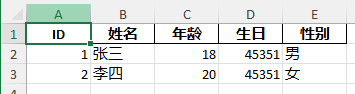
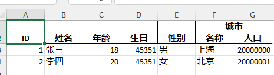

# excel-apt

基于apt的excel导入导出工具.

特点:
- 零反射
- 高效率
- 低内存占用

## 使用
### 简单案例
实体类
```java
@ExcelEntity
@Data
@NoArgsConstructor
@Accessors(chain = true)
public class User {
  @ExcelColumn("ID")
  private Long id;

  @ExcelColumn("姓名")
  private String name;

  @ExcelColumn("年龄")
  private Integer age;

  @ExcelColumn("生日")
  @LocalDateFormat("yyyy-MM-dd")
  private LocalDate birthday;

  @ExcelColumn("性别")
  // 转换配置
  @ExcelConverter(writer = SexConverter.class, reader = SexConverter.class)
  private boolean sex;
}
```

导出

```java
List<User> users =
    List.of(
        new User().setId(1L).setName("张三").setAge(18).setBirthday(LocalDate.now()).setSex(true),
        new User()
            .setId(2L)
            .setName("李四")
            .setAge(20)
            .setBirthday(LocalDate.now())
            .setSex(false));
var workbook =
    users.stream().collect(UserConverter.collectorOf(new FileOutputStream("user.xlsx")));
workbook.finish();
```
导出结果:



导入
```java
UserConverter.streamOf(new ReadableWorkbook(new File("user.xlsx")))
    .forEach(System.out::println);

// 输出
// User(id=1, name=张三, age=18, birthday=2024-02-29, sex=true)
// User(id=2, name=李四, age=20, birthday=2024-02-29, sex=false)
```

### 实体嵌套
实体类
```java
@ExcelEntity
@Data
@NoArgsConstructor
@Accessors(chain = true)
public class City {
  @ExcelColumn("名称")
  private String name;

  @ExcelColumn("人口")
  private Long population;
}

@ExcelEntity
@Data
@NoArgsConstructor
@Accessors(chain = true)
public class User {
  @ExcelColumn("ID")
  private Long id;

  @ExcelColumn("姓名")
  private String name;

  @ExcelColumn("年龄")
  private Integer age;

  @ExcelColumn("生日")
  @LocalDateFormat("yyyy-MM-dd")
  private LocalDate birthday;

  @ExcelColumn("性别")
  // 转换配置
  @ExcelConverter(writer = SexConverter.class, reader = SexConverter.class)
  private boolean sex;
  @ExcelColumn("城市")
  private City city;
```

导出
```java
List<User> users =
    List.of(
        new User()
            .setId(1L)
            .setName("张三")
            .setAge(18)
            .setBirthday(LocalDate.now())
            .setSex(true)
            .setCity(new City().setName("上海").setPopulation(20000000L)),
        new User()
            .setId(2L)
            .setName("李四")
            .setAge(20)
            .setBirthday(LocalDate.now())
            .setSex(false)
            .setCity(new City().setName("北京").setPopulation(20000001L)));
var workbook =
    users.stream().collect(UserConverter.collectorOf(new FileOutputStream("user.xlsx")));
workbook.finish();
```

导出结果:



导出
```java
UserConverter.streamOf(new ReadableWorkbook(new File("user.xlsx")))
    .forEach(System.out::println);

// 输出
// User(id=1, name=张三, age=18, birthday=2024-02-29, sex=true, city=City(name=上海, population=20000000))
// User(id=2, name=李四, age=20, birthday=2024-02-29, sex=false, city=City(name=北京, population=20000001))
```
